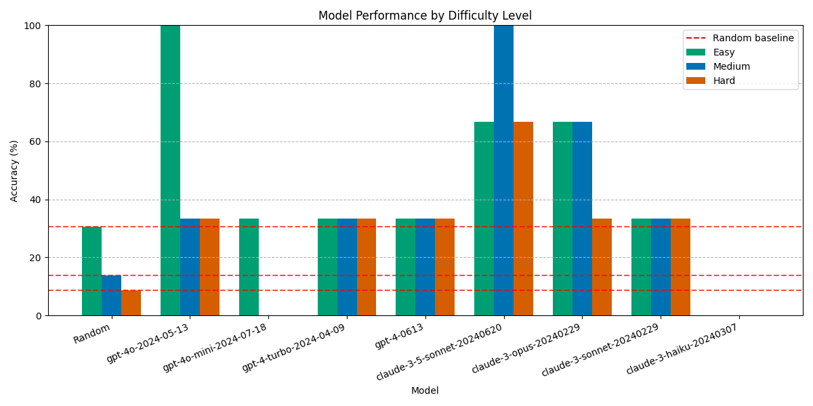

# Sherlock eval

Eval that tests LLMs ability to determine the culprit in "Sherlock Holmes"-like murder mysteries, inspired by an [episode of the Dwarkesh Podcast](https://x.com/dwarkesh_sp/status/1825931761118794102).

## Leaderboard

|                            |   easy |   medium |   hard |   Average |
|:---------------------------|-------:|---------:|-------:|----------:|
| claude-3-5-sonnet-20240620 |   33.3 |     66.7 |   66.7 |      55.6 |
| claude-3-opus-20240229     |   33.3 |     33.3 |   33.3 |      33.3 |
| gpt-4-turbo-2024-04-09     |   33.3 |     33.3 |   33.3 |      33.3 |
| claude-3-sonnet-20240229   |   66.7 |      0.0 |    0.0 |      22.2 |
| gpt-4o-2024-05-13          |   66.7 |      0.0 |    0.0 |      22.2 |
| gpt-4-0613                 |   33.3 |     33.3 |    0.0 |      22.2 |
| Random                     |   30.6 |     13.7 |    8.6 |      17.6 |
| gpt-4o-mini-2024-07-18     |    0.0 |      0.0 |    0.0 |       0.0 |
| claude-3-haiku-20240307    |    0.0 |      0.0 |    0.0 |       0.0 |

`claude-3-5-sonnet-20240620` is the overall leader. Mysteries are classified as either `easy`, `medium` or `hard`, see the [make_story.ipynb](https://github.com/patrickmziet/sherlock/blob/main/make_story.ipynb) notebook for more detail. 

The dotted red lines show the performance of choosing a suspect at random for `easy`, `medium` and `hard`. For example `gpt-4o-2024-05-13` performs much better than random for `easy` mysteries, 66.7% vs 30.6%.

At the moment, a lot of models fail to even output an acceptable answer, resulting in 0%, see `claude-3-haiku-20240307`. This is a problem that possibly requires better prompting.

## The mysteries

### Usefulness of eval

It is crucial to ask how useful this eval is. First, we note that murder mysteries are ambiguous, subjective, indeterminate, fuzzy, and open-ended. Sherlock could just as well accuse other suspects with plausible explanations. In contrast to the [MMLU benchmark](https://arxiv.org/pdf/2009.03300) which asks objective, well-defined questions like:

> When you drop a ball from rest it accelerates downward at 9.8 m/s². If you instead throw it downward assuming no air resistance its acceleration immediately after leaving your hand is
> (A) 9.8 m/s²
> (B) more than 9.8 m/s²
> (C) less than 9.8 m/s²
> (D) Cannot say unless the speed of throw is given

At its best, so what does it mean for an LLM to do well on this eval? What is it doing?
- Synthesising a whole bunch of information. Being able to ignore red herrings, and pick up on subtle details.
- Ability to make informed *predictions*. Take a whole mess of information and construct the most plausible explanation. 

At its worst, what is happening with this eval?
- It is just retrieving the culprit from or similar to the Sherlock Holmes mysteries in its training data. Having *novel* mysteries will make this eval valuable.

I think that if we see the latest models performing better, we can conclude that the eval is directionally correct. For example, if `claude-3-5-sonnet-20240620` performs better than `claude-3-opus-20240229` we know it is probably directionally correct.

### Description of mysteries

The mysteries have many suspects, and one culprit. Difficulty is determined by multiple criteria such as number of suspects, timeline complexity, motive, red herrings, alibis, and forensic evidence. Importantly, Sherlock Holmes reveals the culprit in the following way:

> He turned suddenly, fixing his gaze on one individual. "<mark>The culprit is none other than</mark> Maurice Devereaux!"

And only *after* this reveal does Sherlock give us his reasoning. So the LLM does not see a lead up to a reveal. 

> The artistic director's face drained of color. "This... this is preposterous! I loved Adeline!"
> "Indeed you did," Holmes said gravely. "Your love, however, was not reciprocated. You were the phantom, Monsieur Devereaux, but not of this opera – of Adeline's past."
> Holmes went on to explain how Devereaux had known Adeline in her youth, before her rise to fame. He had been a struggling composer then, believing Adeline to be his muse, his ticket to greatness. But she had left him behind, soaring to heights he could only dream of.
> "You followed her career obsessively, didn't you? Clipping every review, attending every performance. You even managed to secure a position as artistic director, all to be close to her. But it wasn't enough. She didn't remember you, did she?"
> Devereaux's composure cracked. "She was ungrateful! I made her what she was! Without me, she would have been nothing!"
> Holmes nodded solemnly. "So you decided to immortalize her – to turn her into the phantom that had haunted you all these years. The poison in her eye drops, the mask, the hidden room in the basement... all part of your grand opus."
> As Lestrade moved to apprehend Devereaux, Holmes turned to the astonished gathering. "The rest of you played your parts unwittingly. Your conflicts, your ambitions, your secrets – all woven into Devereaux's narrative to obscure the truth."
> In the days that followed, as Devereaux confessed to his crimes, the full scope of his deception came to light. He had manipulated events behind the scenes for years, stoking rivalries and nurturing obsessions, all building to his tragic finale.
> As Holmes and Watson left the Opera House for the last time, the doctor couldn't help but marvel at the complexity of the case. "I must say, Holmes, I'm still astounded by how you pieced it all together."
> Holmes lit his pipe, a thoughtful expression on his face. "In the end, Watson, it was the music that gave him away. For in his attempt to compose the perfect tragedy, Devereaux forgot the most important rule of opera – the show must go on."

### Contributing a mystery

The aim is to have mysteries contributed from other people, please fork the repo, make a new story and submit it as a PR. 

Follow the instructions in the [make_story.ipynb](https://github.com/patrickmziet/sherlock/blob/main/make_story.ipynb) notebook. 

Have a look at the existing stories in [data/mysteries](https://github.com/patrickmziet/sherlock/tree/main/data/mysteries).